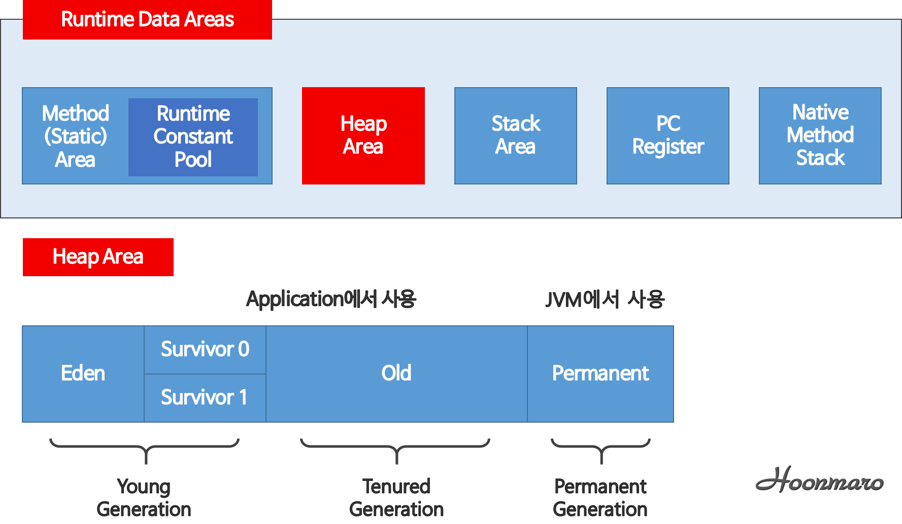

##  JVM 구조

- 실행될 클래스 파일을 메모리에 로드 후 초기화 작업 수행
- 메소드와 클래스 변수들을 해당 메모리 영역에 배치
- 클래스로드가 끝난 후 JVM은 main 메소드를 찾아 지역변수,객체변수,참조변수를 스택에 쌓음
- 다음 라인을 진행하면서 상황에 맞는 작업 수행(함수 호출,객체 할당)

- Class Loader : JVM 내로 클래스를 로드하고 링크를 통해서 배치하는 작업을 수행하는 모듈로써 런타임시 동적으로 클래스를 로드한다.
- Execution Engine : Class Loader를 통해 JVM 내의 런타임 영역에 배치된 바이트코드를 실행한다. 이때 Execution Engine 은 자바 바이트 코드를 명령어 단위로 읽어서 실행한다.

### Runtime Data Areas

- Method (Static) Area : JVM 이 읽어들인 클래스,인터페이스에 대한 런타임 상수 풀,멤버 변수(필드),클래스 변수(static), 생성자와 메소드를 저장하는 공간

- Runtime Constant Pool 

  - 메소드 영역에 포함되지만 독자적 중요성이 있다.
  - 클래스 파일 constant_pool 테이블에 해당하는 영역이다.
  - 클래스와 인터페이스 상수,메소드와 필드에 대한 모든 레퍼런스를 저장한다.
  - JVM은 런타임 상수풀을 통해 해당 메소드나 실제 메모리상의 주소를 찾아 참조

- 메소드 영역/런타임 상수 풀의 사용기간 및 스레드 공유 범위

  - JVM 시작시 생성
  - 프로그램 종료 시까지
  - 명시적으로 null 선언 시
  - 구성 방식이나 GC방법은 JVM 벤더 마다 다를 수 있다.

- Heap Area

  - JVM이 관리하는 프로그램 상에서 데이터를저장하기 위해 런타임 시 동적으로 할당하여 사용하는 영역이다.
  - New 연산자로 생성된 객체 또는 객체(인스턴스)와 배열을 저장한다.
  - 힙 영역에 생성된 객체와 배열은 스택 영역의 변수나 다른 객체의 필드에서 참조한다.
  - 참조하는 변수나 필드가 없다면 의미없는 객체가 되어 GC의 대상이 된다.
    - 객체가 더 이상 사용되지 않거나 명시적으로 null 선언시
    - GC 대상
    - 구성방식이나 GC방법은 JVM 밴더마다 다를 수 있다.
    - 모든 스레드에서 공유한다.

- Stack Area

  -  각 스레드마다 존재.스레드가 시작될때 할당된다.
  - 메소드를 호출할 때마다 프레임에 추가(push)하고 메소드가 종료되면 해당 프레임을 제거(pop) 수행
  - 선입후출(FILO) push와 pop 사용
  - 메소드 호출시 생성되는 스레드 수행정보를 기록하는 Frame을 저장
  - 메소드 정보,지역변수,매개변수,연산 중 발생하는 임시 데이터 자장
  - **기본(원시)타입 변수는 스택영역에 직접 값을 가진다.**
  - **참조타입 변수는 힙 영역이나 메소드 영역의 객체 주소를 가진다.**
  - 기본타입 : byte,char,int etc...
  - 참조타입 : 

- **PC Register**

- - 현재 수행 중인 JVM 명령 주소를 갖는다.
  - 프로그램 실행은 CPU에서 인스트럭션(Instruction)을 수행.
  - CPU는 인스트럭션을 수행하는 동안 필요한 정보를 CPU 내 기억장치인 레지스터에 저장한다.
  - 연산 결곽값을 메모리에 전달하기 전 저장하는 CPU 내의 기억장치

- **Native Method Stack Area**

- - 자바 외 언어로 작성된 네이티브 코드를 위한 Stack이다.
  - 즉, JNI(Java Native Interface)를 통해 호출되는 C/C++ 등의 코드를 수행하기 위한 스택이다.
  - 네이티브 메소드의 매개변수, 지역변수 등을 바이트 코드로 저장한다.

### Heap Area

- **Young Generation**: 이 영역은 자바 객체가 생성되자마자 저장되고, 생긴지 얼마 안되는 객체가 저장되는 공간이다. 시간이 지나 우선순위가 낮아지면 Old 영역으로 옮겨진다. 이 영역에서 객체가 사라질 때 Minor GC가 발생한다.

  **Old(Tenured) Generation**: Young Generation 영역에서 저장되었던 객체 중에 오래된 객체가 이동되어 저장되는 영역이다. 이 영역에서 객체가 사라질 때 Major GC(Full GC)가 발생한다.

  **Permanent Generation**: 클래스 로더에 의해 로든되는 클래스, 메소드 등에 대한 메타 정보가 저장되는 영역으로 JVM에 의해 사용된다. 리플렉션을 사용하여 동적으로 클래스가 로딩되는 경우에 사용된다. 내부적으로 리플렉션 기능을 자주 사용하는 Spring Framework를 이용할 경우 이 영역에 대한 고려가 필요하다.

- 

  

  