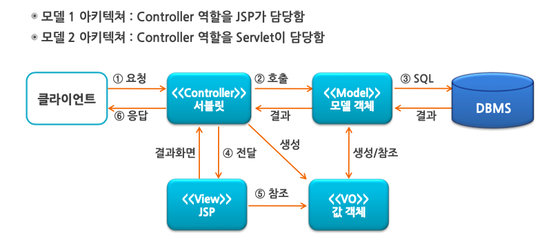
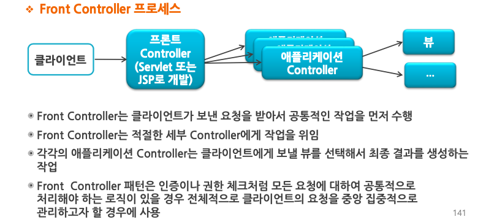
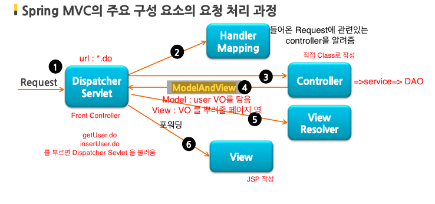
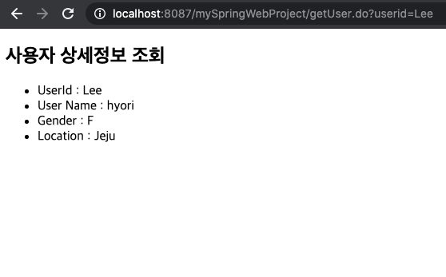
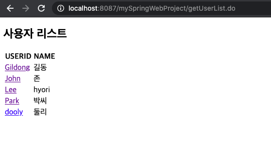
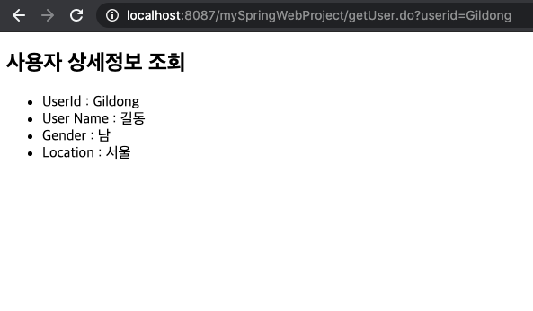
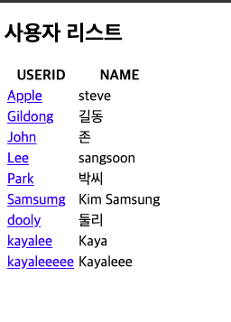

# 🤹‍♀️ Spring MVC 패턴 사용하기

### MVC(Model View Controller) 패턴이란?

> - 비지니스 로직과 프레젠테이션 로직을 분리하기 위한 SW 설계패턴
> - 이를 통해 사용자에게 보여지는 화면과 뒷단의 비지니스 로직이 서로 영향을 받지 않게 수정하고 유지보수 할 수 있음
> - 이를 **관심사의 분리**(Sepearion of Concerns / Seperation of Responsibility)라고도 함

<br>

### MVC 컴포넌트의 역할

#### Model(모델)

    - 데이터나 비지니스 로직과 같은 어플리케이션 정보를 다룸 (Java Class)
    - DB와 연동하여 사용자가 입/출력한 데이터를 처리
    - 여러개의 데이터 변경(추가, 변경, 삭제)을 하나의 작업으로 묶는 트랜잭션 처리
    - DAO, Service, VO 클래스 해당

#### View(뷰)

    - 사용자에게 보여지는 화면 구성
    - 모델이 처리한 데이터나 작업결과를 가지고 사용자에게 출력할 화면을 만듬
    - HTML, CSS, JS등으로 웹 브라우저에서 출력될 UI를 만듬
    - HTML과 JSP를 사용하여 작성 가능

#### Controller(컨트롤러)

    - Model과 View사이의 상호작용 담당
    - 클라이언트의 요청을 수행하는 담당 모델 컴포넌트를 호출
    - 클라이언트가 데이터를 보냈다면 이를 적절히 가공하여 모델에게 전달
    - 모델이 업무 수행을 완료하면 결과를 뷰에게 전달
    - Servelt과 JSP로 작성 가능

[MVC 패턴 도형화]


<br>

### Spring MVC의 특징

> - Spring은 DI나 AOP같은 기능뿐 아니라 **서블릿 기반**의 웹 개발을 위한 MVC 프레임워크 제공
> - 프레임워크 자체에서 모델 2 아키텍처나 Front Controller 패턴을 제공
> - Front Controller 역할을 하는 **DispatcherServlet**이라는 클래스를 맨 앞에 놓고 서버로 들어오는 요청과 예외상황을 받아서 처리

<br>

**[모델 아키텍처]**



**[Front Controller]**



<br>
<br>

### Spring MVC의 구성요소

| 구성요소          | 설명                                                                                                                                                                                                                                      |
| ----------------- | ----------------------------------------------------------------------------------------------------------------------------------------------------------------------------------------------------------------------------------------- |
| DispatcherServlet | - Front Controller <br> - 클라이언트의 요청은 세부 Controller에게 전달 <br> - 리턴 결과는 View에 전달                                                                                                                                     |
| HandlerMapping    | - URL과 요청정보를 기준으로 어떤 핸들러 객체를 사용할지 결정 <br> - DispatcherServlet은 하나 이상의 핸들러 매핑을 가질 수 있음                                                                                                            |
| Controller        | - 클라이언트의 요청을 처리한 후 Model 호출 <br> - 그 결과를 다시 DispatchServlet에게 알려줌                                                                                                                                               |
| ModelAndView      | - Controller가 처리한 데이터 및 화면에 대한 정보를 갖는 객체 <br > - Controller에서 Service를 호출한 결과를 받아서 View에게 전달하기 위해 데이터와 화면정보를 저장 <br> - addObject 매소드를 이용해 View에 전달할 데이터를 저장할 수 있음 |
| View              | - 화면에 뿌려줄 Controller의 처리 결과를 갖는 객체                                                                                                                                                                                        |
| ViewResolver      | - Controller가 반환한 뷰 이름을 기반으로 Controller 처리 결과를 생성할 뷰 결정                                                                                                                                                            |

<br >

**[Spring MVC 구성요소]**



<br><br>

### 🧚 Spring MVC 작성하기 : 조회 기능

**[목표]**

- DB에 저장된 User정보를 불러오는 간단한 MVC 패턴 만들어보기
- UserVO와 JSP, Controller 활용하기

<br>

1. 클라이언트의 요청을 받는 DispatcherServlet (=FrontController)을 web.xml에 설정하기

[web.xml]

```xml
<!-- DispatcherServlet 설정해주기~! -->
<servlet>
    <servlet-name>springDispatcherServlet</servlet-name>
    <servlet-class>org.springframework.web.servlet.DispatcherServlet</servlet-class>
        <init-param>
            <param-name>contextConfigLocation</param-name>
            <param-value>classpath:config/spring_beans_mvc.xml</param-value>
        </init-param>
        <load-on-startup>1</load-on-startup>
</servlet>

<!-- 모든 요청들을 DispatcherServlet에 매핑해주기 -->
    <servlet-mapping>
	    <servlet-name>springDispatcherServlet</servlet-name>
	    <url-pattern>*.do</url-pattern>
    </servlet-mapping>
```

<br>

2. 클라이언트의 요청을 처리할 Controller 및 View 작성

**[Controller를 위한 핵심 어노테이션]**

| 구성요소        | 설명                                     |
| --------------- | ---------------------------------------- |
| @Controller     | Controller 클래스 정의                   |
| @RequestMapping | HTTP요청을 처리할 Controller 매소드 정의 |
| @RequestParam   | HTTP 요청에 포함된 파라미터 참조시 사용  |

<br>

[index.jsp]

```html
<%@ page language="java" contentType="text/html; charset=UTF-8"
pageEncoding="UTF-8"%>
<!DOCTYPE html>
<html>
  <head>
    <meta charset="UTF-8" />
    <title>Insert title here</title>
  </head>
  <body>
    <h2>사용자 관리 메인화면</h2>
    <!-- form action은 UserController에 @RequestMapping)의 값과 같아야 함 -->
    <form method="get" action="getUser.do">
      <input type="text" name="userid" /><br /><br />
      <input type="submit" value="조회" />
    </form>
    <hr />
    <a href="getUserList.do">사용자 리스트</a>
  </body>
</html>
```

**[UserController.java]**

```java
@Controller
public class UserController {
	@Autowired
	UserService service;

	@RequestMapping("/getUser.do")
	//form action과 Controller 매핑
        //@RequestParam에서 받아오는 변수 명이 다를 경우, 인자값을 넘겨줌
	//만약 String userid로 변수 명을 같게 설정하면 필요 없음
        // == public ModelAndView getUser(String userid)
	public ModelAndView getUser(@RequestParam("userid") String id) {

		UserVO user = service.getUser(id);

        //ModelAndView(View 페이지 명, Model명, 객체명)
		return new ModelAndView("userDetail.jsp", "uservo", user);
	}
}
```

[userDetail.jsp]

```html
<%@ page language="java" contentType="text/html; charset=UTF-8"
pageEncoding="UTF-8"%>
<!DOCTYPE html>
<html>
  <head>
    <meta charset="UTF-8" />
    <title>User Detail 사용자 상세보기</title>
  </head>
  <body>
    <h2>사용자 상세정보 조회</h2>

    <ul>
      <!-- Controller ModelAndView에서 넘겨준 객체 Model uservo의 매소드 이용-->

      <li>UserId : ${uservo.userId}</li>
      <!-- <li>UserId : ${uservo.getUserId}</li>
      랑 같은 뜻 프레임워크에서 제공하는 기능으로 get을 생략하고 소문자로 시작하게 코드 작성 가능 -->
      <li>User Name : ${uservo.name}</li>
      <li>Gender : ${uservo.gender}</li>
      <li>Location : ${uservo.city}</li>
    </ul>
  </body>
</html>
```

[웹 브라우저 :index]


<br>

[웹 브라우저 :Lee 조회한 userDetail]


3.  전체 리스트 받아오도록 코드 추가

**[UserController.java]**

```java
//index <a href="getUserList.do">사용자 리스트</a>와 매핑
@RequestMapping("/getUserList.do")

//UserList를 모델에 담고, String으로리턴할 결과페이지 jsp을 매핑해줌
public String getUsers(Model model) {
	List<UserVO> userList = service.getUserList();

    //addAttriebute( Attribute Name, Attribute Value )
	model.addAttribute("users", userList);
	return "userList.jsp";
}
```

[userList.jsp] : index에서 a태그로 걸어놓은 사용자 전체페이지 view

> - JSTL 사용을 위해 메이븐 의존성 설정
> - **JSTL이란?** 자바 코드를 HTML처럼 쓸 수 있도록 한 라이브러리

```html
<html>
  <head>
    <meta charset="UTF-8" />
    <title>Insert title here</title>
  </head>
  <body>
    <h2>사용자 리스트</h2>
    <table>
      <tr>
        <th>USERID</th>
        <th>NAME</th>
      </tr>

      <!-- JSTL 사용 -->
      <!-- Controller에서 넘겨준 users(리스트)를 items로 받고-->
      <!-- 리스트 구성요소를 user객체로 받아 get매소드 실행-->
      <c:forEach var="user" items="${users}">
        <tr>
          <td>${user.userId}</td>
          <td>${user.name}</td>
        </tr>
      </c:forEach>
    </table>
  </body>
</html>
```

[웹 브라우저 : userLsit]



4.  전체 리스트의 USERID 클릭 시, 상세페이지로 이동하도록 코드 추가
    [userList.jsp]

```html
  <body>
    <h2>사용자 리스트</h2>
    <table>
      <tr>
        <th>USERID</th>
        <th>NAME</th>
      </tr>
      <c:forEach var="user" items="${users}">
        <tr>
          <td>
            <!-- a 태그로 getUser.do로 값을 다시 Controller로 넘겨주고
            거기서 getUser 매소드가 userid의 값을 인자로 받도록 설정 -->
            <!-- url?userid=${user.userId} -->
            <a href="getUser.do?userid=${user.userId}"> ${user.userId} </a>
          </td>
          <td>${user.name}</td>
        </tr>
      </c:forEach>
    </table>
  </body>
</html>
```

<br>

[웹 브라우저: 리스트의 이름 클릭 시]


<br>

5.  코드 내에서 .jsp 확장자를 생략하고 이미 spring\*beans.xml에서 컴포넌트로 등록된 Controller를 재설정하도록 xml 설정
    [spring_beans***mvc**.xml]

```xml
	<!-- JSP 확장명 생략할 수 있도록 설정 -->
	<!-- 아래 주석은 Controller에서 포워딩 되는 .jsp 확장자를 생략할 수 있다. -->
	<bean id="viewResolver"
		class="org.springframework.web.servlet.view.InternalResourceViewResolver">
		<property name="prefix" value="/" />
		<property name="suffix" value=".jsp" />
	</bean>


	<!-- component를 스캔해주는 설정 / controller관련만 어노테이션만 컴포넌트로 스캔하도록 여기서 설정 -->
	<!-- 이미 설정되어 있던 spirng_beans에서는 Controller를 exclude하는 설정을 해줘야 함  -->

	<context:component-scan
		base-package="myspring.user">
		<context:include-filter type="annotation"
			expression="org.springframework.stereotype.Controller" />
	</context:component-scan>
```

<br>

[spring_beans.xml]

- 이미 컴포넌트 스캔시 Controller가 포함되어있었음
- srping_beans_mvc.xml에서 Controller만 다시 끌어와서 설정해줬기 때문에 여기서는 Controller를 exclude해줌

```xml
<!-- Component AutoScanning을 위한 설정 -->
<!-- @Repository or @Component로 빈이 추가 될때 빈을 스캐닝할 패키지를 연결해줌  -->
<context:component-scan base-package="myspring.di.annotaion, myspring.user">
	<context:exclude-filter type="annotation"
			expression="org.springframework.stereotype.Controller" />
</context:component-scan>
```

<br><br>

### 🧚‍♀️ Spring MVC 작성하기 2 : 삽입 기능

<br>

| 구성요소        | 설명                                                                                                                                     |
| --------------- | ---------------------------------------------------------------------------------------------------------------------------------------- |
| @ModelAttribute | - HTTP 요청으로 들어온 인자를 모델객체로 바인딩 <br> - JSP에서 input값의 value를 설정된 name을 통해 VO객체에 알아서 저장해주는 역할을 함 |

<br>

**[UserController.java]**

```java
	@RequestMapping("/insertUserForm.do")
  //insertUserForm에 성별 리스트와 도시 리스트 보내주기
	public String insertUserFor(HttpSession session) {

		List<String> genderList = new ArrayList<String>();
		genderList.add("남");
		genderList.add("여");

		List<String> cityList = new ArrayList<String>();
		cityList.add("서울");
		cityList.add("부산");
		cityList.add("대구");
		cityList.add("제주");

		//session에 genderList와 cityList 저장하기
		//setAttribute(name city 벨류값, 저장할 List)
		session.setAttribute("gender", genderList);
		session.setAttribute("city",cityList);

		//userInsser.jsp로 리턴해주기
		return "userInsert";
	}

	@RequestMapping("/insertUser.do")

  //insertUserForm에서 넣어준 값이 @ModelAttribute를 통해 UserVO에
  //자동으로 저장되어 그 값으로 객체가 생성됨

	public String insertUser(@ModelAttribute UserVO user) {
		//생성된 UserVO user 등록요청
		service.insertUser(user);

		//등록 후 사용자 출력
		return "redirect:/getUserList.do";
	}
```

<br>

[userInsert.jsp]

```html
<%@ page language="java" contentType="text/html; charset=UTF-8"
    pageEncoding="UTF-8"%>
<%@ taglib uri="http://java.sun.com/jsp/jstl/core" prefix="c"%>
<html>
<head>
<title>사용자 정보 등록 </title>
<!-- Optional theme -->
<link rel="stylesheet" href="https://maxcdn.bootstrapcdn.com/bootstrap/3.3.7/css/bootstrap.min.css">
<script src="https://ajax.googleapis.com/ajax/libs/jquery/3.1.1/jquery.min.js"></script>
<script src="https://maxcdn.bootstrapcdn.com/bootstrap/3.3.7/js/bootstrap.min.js"></script>
</head>
<body>
  <div class="container">
	<h2 class="text-center">사용자정보 등록 </h2>
	  <div>
	    <form method="post" action="insertUser.do"  >
            <table  class="table table-bordered table table-hover">
		<tr>
		  <td>아이디 : </td>
		  <td><input type="text" name="userId"  /></td>
		</tr>
		<tr>
		  <td>이름 : </td>
		  <td><input type="text" name="name" /></td>
		</tr>
		<tr>
		  <td>성별 : </td>
		  <td><c:forEach var="genderName" items="${sessionScope.gender}">
		    <input type="radio" name="gender" value="${genderName}">${genderName}
                </c:forEach></td>
                </tr>
		<tr>
		  <td>거주지 : </td>
		  <td><select name="city">
		    <c:forEach var="cityName" items="${sessionScope.city}">
			  <option value="${cityName}">${cityName}</option>
		    </c:forEach>
                  </select></td>
		</tr>
		<tr><td colspan="2"  class="text-center">
                 <input type="submit" value="등록" /></td>
                </tr>
		<tr>
		<td colspan="2" class="text-center"><a href="getUserList.do">사용자 목록 보기 </a></td>

		</tr>
	</table>
	  </form>
	  </div>
	</div>
</body>
</html>

```

[웹 페이지 : userInsert.jsp]


<br>

[웹 페이지 : userList.jsp]

- 유저 등록 후 유저 리스트로 redirect


