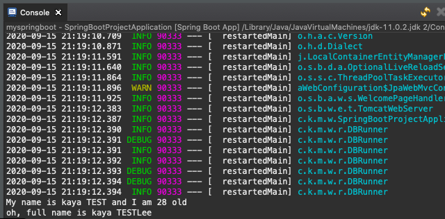
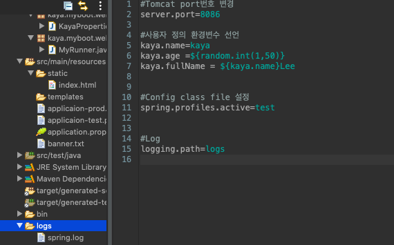

# 🛰 Spring Boot 스프링 부트 환경설정

[목표]

- 스프링부트를 웹 어플리케이션 타입, 런타임 환경관리, 환경 변수 설정하기

<br>

### 웹 어플리케이션 타입 지정하기 :SpringApplication

> - 스프링 부트에서 **SpringApplication** 객체를 통해 어플리케이션 타입 지정 가능
> - 스프링 컨테이너의 인터페이스인 ApplicationContext를 개발자 대신 생성

| WevAppplicaion.type         | AnnotationConfig                                      |
| --------------------------- | ----------------------------------------------------- |
| WebApplicationType.SERVLET  | - AnnotationConfigServletWebServerApplicationContext  |
| WebApplicationType.REACTIVE | - AnnotationConfigReactiveWebServerApplicationContext |
| WebApplicationType.NONE     | – AnnotationConfigApplicationContext                  |

<br>

[SpringBootProjectApplicaion.java]

```java
@SpringBootApplication
public class SpringBootProjectApplication {

    public static void main(String[] args) {

	//Spring Application 객체 생성
	SpringApplication applicaion = new SpringApplication(SpringBootProjectApplication.class);

	//Applicaion type을 서블릿으로 설정 setting
	applicaion.setWebApplicationType(WebApplicationType.SERVLET);

	applicaion.run(args);
	}
}
```

<br>

### Runner 클래스 작성하기 : ApplicationRunner & properties

> - SpringApplication 실행된 후에 arguments 값을 받아 처리하거나 무엇인가를 실행하고 싶을 때 **ApplicationRunner** 인터페이스를 구현하는 Runner 클래스를 작성
> - @Order로 처리 순서 지정 가능

<br>

[applicaion.properties] : Runner.class에서 받아올 환경 변수 선언

```xml
#Tomcat port번호 변경
server.port=8086

#사용자 정의 환경변수 선언
kaya.name=kaya
kaya.age =${random.int(1,50)}
kaya.fullName = ${kaya.name}Lee
```

[MyRunner.java] : 환경변수 값을 @Value로 매핑하고 출력하기

```java
@Component
@Order(1)
//Order로 Runner의 순위를 줄 수 있음
public class MyRunner implements ApplicationRunner {
	@Value("${kaya.name}")
	String name;

	@Override
	public void run(ApplicationArguments args) throws Exception {
	System.out.println("My name is : " + name);
	}
}
```

<br>

#### + @ConfigurationProperties : 환경변수를 Class로 생성해서 받아오기

> - application.properties의 공통 설정들을 Class로 만든 후, getter / setter 매소드를 통해 받아오기
> - @ConfiguraionProperties로 외부 설정 값 주입 후
> - @Autowired로 자동 주입
> - 따로 프로퍼티 클래스 작성 시, Bean으로 등록해서 다른 Bean에도 주입 가능

<br>

[pom.xml] : @ConfiguraionProperties를 사용하려면 spring-boot-configuration-processor 의존성을 먼저 설정를 해줘야함

```xml
<dependency>
	<groupId>org.springframework.boot</groupId>
	<artifactId>spring-boot-configuration-processor</artifactId>
	<optional>true</optional>
</dependency>
```

[application.properties] : 사용자 정의 환경변수 선언

```xml
#사용자 정의 환경변수 선언
kaya.name=kaya
kaya.age =${random.int(1,50)} //1-50중 랜덤숫자
kaya.fullName = ${kaya.name}Lee
```

[KayaProperties.java] : 환경변수를 사용할 클래스 작성

```java
@Component
@ConfigurationProperties("kaya")
// 공통되는 kaya.* 를 ConfigurationProperties로 매핑
public class KayaProperties {
	private String name;
	private int age;
	private String fullName;
	public String getName() {
		return name;
	}
	public void setName(String name) {
		this.name = name;
	}
	public int getAge() {
		return age;
	}
	public void setAge(int age) {
		this.age = age;
	}
	public String getFullName() {
		return fullName;
	}
	public void setFullName(String fullName) {
		this.fullName = fullName;
	}
}
```

[MyRunner.java] : 테스트 파일

```java
@Component
@Order(1)
//Order로 Runner의 순위를 줄 수 있음
public class MyRunner implements ApplicationRunner {
	@Value("${kaya.name}")
	String name;

    //위에 클래스로 설정해 둔 프로퍼티 받아오기
	@Autowired
	private KayaProperties property;

	@Override
	public void run(ApplicationArguments args) throws Exception {

    System.out.println("My name is " + name + " and I am "+property.getAge()+" old"  );
    System.out.println("oh, full name is "+ property.getFullName());
	}

}
```

[콘솔 출력]



<br><br>

### 어플리케이션의 런타임 환경 관리: @Profile()

> - 스트링 부트 어플리케이션의 런타임 환경 관리
> - @Profile을 통해 테스트 환경에서 실행할 지, 프로덕션 환경에서 실행할 지 설정 가능
> - 테스트 / 프로덕션 환경 설정파일을 각각 따로 생성 후, **spring.profiles.active** 값을 통해 활성화
> - 개발와 운용모드의 빈을 각 각 다르게 구현을 해놓고 개발모드에는 개발 빈을, 운영모드에는 운영 빈을 활성화 시켜서 사용

<br>

**Test/Prod Configuration Class 작성**

[ProdConfig.java] : 서비스 운영시 사용할 Config class

```java
@Profile("prod")
@Component
public class ProdConfig {

	@Bean
	public String hello() {
		return "현재 운영 모드 실행 중 ";
	}
}
```

[TestConfig.java] : 개발모드에서 사용하는 Config class

```java
@Profile("prod")
@Component
public class ProdConfig {

	@Bean
	public String hello() {
		return "현재 운영 모드 실행 중 ";
	}
}

```

[applicaion.properties] : 현재 활성화 시킬 Bean설정

```xml
#Config class file 설정
spring.profiles.active=test
```

<br>
[MyRunner.java]

```java
@Component
@Order(2)
public class MyRunner implements ApplicationRunner {

	@Autowired
	private String hello;
    //Test와 prod class에서 선언한 hello 매소드를 Autowired
    //활성화 된 bean의 hello를 불러옴

	@Override
	public void run(ApplicationArguments args) throws Exception {
		System.out.println("profile : " + hello);
	}
}
```

[콘솔] : properties에 active로 설정해 둔 test 실행


<br><br>

### 스프링 부트 Logger 설정

> - 부트에 기본적으로 설정된 로그퍼사드 : Logback
> - 스프링 부트 기본 로거를 설정하면 logs/spring.log 파일 자동생성
> - **logging.level.패키지명** = 로그 레벨
> - 로그 레벨(log level)을 출력할 Properties 파일을 등록

<br>

[applicaion.properties] : logging.path 설정 (logs폴더 자동 생성)


[application-prod.properties] : 서비스 운영모드에서 출력될 로그 환경 설정

```xml
kaya.name=kaya Production

#log level
logging.level.com.kaya.myboot.web=info
```

[application-test.properties] : 개발 모드에서 출력될 로그 환경 설정

```xml
kaya.name=kaya TEST

#log level
logging.level.com.kaya.myboot.web=debug
```

[MyRunner.java] : log 출력할 Runner 클래스 작성 / Logger객체와 LoggerFactory사용

```java
@Component
@Order(2)
public class MyRunner implements ApplicationRunner {

	@Autowired
	private String hello;

	//getLogger(현재 실행중인 클래스명)
	private Logger logger = LoggerFactory.getLogger(MyRunner.class);

	@Override
	public void run(ApplicationArguments args) throws Exception {
		logger.info("=======>> start >>info 모드에서만 출력 되는 것입니다. ========");
		logger.debug("Logger Class Name : " + logger.getClass().getName());
		logger.debug("profile : " + hello);
		logger.debug("My name is " + name + " and I am "+property.getAge()+" old" );
		logger.info("=======>> end >> info 모드에서만 출력 되는 것입니다. ========");
	}
}

```

[콘솔] : 현재 application.properties에 설정되어있는 spring.profiles.active=test로 인해info와 debug 모두 출력


<br><br>

### 파일 변경시 자동 재시작 설정 : Spring-Boot-Devtools

> - 클래스 패스에 있는 파일이 변경될 때 마다, 자동으로 서버를 재시작하여 변경사항을 반영함

[pom.xml] : devtools dependency 추가

```xml
<dependency>
    <groupId>org.springframework.boot</groupId>
    <artifactId>spring-boot-devtools</artifactId>
</dependency>
```

[추가기능]

: 리스타트 하고 싶지 않은 리소스는? spring.devtools.restart.exclude

: 리스타트 기능 끄려면? spring.devtools.restart.enabled=false
