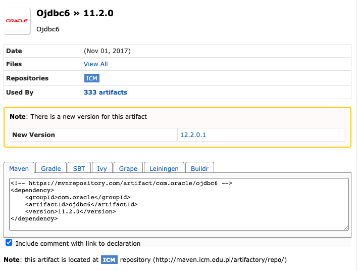
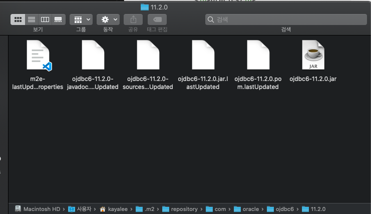
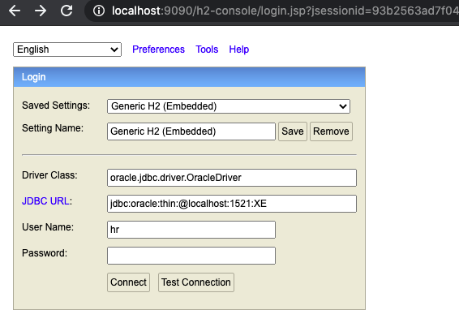
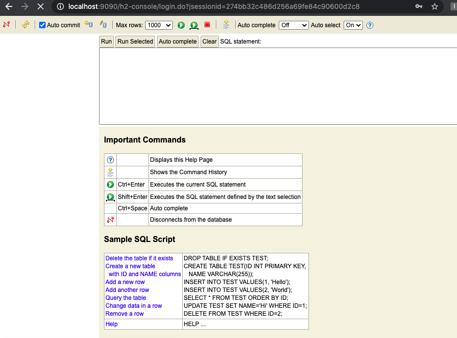
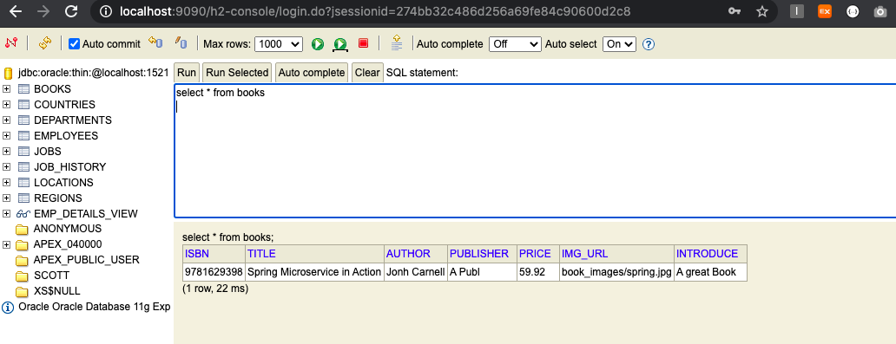

# 🛎 부트와 JDBC 오라클 연결하기 (Mac ver)

[목표]

- 스프링 부트에서 jdbc를 연결하기
- oracle db를 h2로 확인하기

<br>

### JDBC Oracle

> - 오라클 JDBC는 예전에 Spring Framework에서 사용했었는데, 부트로 연결하려니 또 다른 설정방법이 필요
> - oracle jdbc6를 사용해서 db연결 해주고, 성공적으로 db에 반영이 되는지까지 확인하기

<br>

### JDBC 오라클 의존성 설치

> - oracle jdbc가 maven repository에는 예전 버전으로만 있어서 하나하나 설정을 해줘야 한다.
> - JDBC 의존성과 Repository 추가
> - https://mvnrepository.com/artifact/com.oracle/ojdbc6/11.2.0

<br>



[pom.xml]

**1. 의존성 추가**

```xml
<!-- https://mvnrepository.com/artifact/com.oracle/ojdbc6 -->
<dependency>
	<groupId>com.oracle</groupId>
	<artifactId>ojdbc6</artifactId>
	<version>11.2.0</version>
</dependency>
```

**2. properties와 dependencies사이에 repository 추가**

- `<url>ICM repository 주소 </url>`

```xml
<repositories>
	<repository>
	    <id>Oracle</id>
	    <url>http://maven.icm.edu.pl/artifactory/repo/</url>
	</repository>
</repositories>
```

<br>

### jdbc6.jar 추가

> - 위 처럼 의존성 추가를 했는데도 Maven Dependency에 jar파일로 추가가 안될 경우에는 jdbc.jar를 재설정 해줘야한다.
> - jdbc6.jar를 받거나 예전 프로젝트에서 사용하던 jdbc6.jar를 가져와서 경로 설정

<br>

**1. ojdbc6.jar 파일 가져가기**

[/users/사용자/.m2/repository/com/oracle/ojdbc6/11.2.0]



**2. ojdbc6.jar 파일 이름 변경 = ojdbc6-11.2.0**

<br>

**3. 정상적으로 서버가 돌아가는지 확인**


<br>

### properties (YAML)에 jdbc 설정하기

> - applicaion.properties를 application.yml로 확장자를 바꿔서 환경설정해주기

```YAML
server:
  port: 9090

spring:
  h2:
    console:
      enabled: true

  datasource:
    driver-class-name: oracle.jdbc.driver.OracleDriver
    url: jdbc:oracle:thin:@localhost:1521:XE
    username: hr
    password: hr

  jpa:
    database-platform: org.hibernate.dialect.H2Dialect
```

<br>

### h2-console로 확인하기

> - hr계정으로 우선 로그인 후, jdbc가 잘 연결이 되었나 확인
> - **주의!** h2 dependency가 우선적으로 설치되어 있어야 함

<br>

1. [웹 브라우저로 접속] localhost:9090/h2-console



<br>

2. 로그인 후, 잘 연결 되었나 확인



<br><br>

### Table 생성해서, 데이터 넣어보기

> - 데이터를 넣기 전에, oracle sql로 먼저 table을 생성
> - 생성된 테이블에 db 넣기

<br>

**1. command 창에 docker oracle 실행**

> - Mac 오라클 도커 설치하기 : https://stophyun.tistory.com/190

- 도커 run

```bash
 docker run --name oracle11g -d -p 8080:8080 -p 1521:1521 jaspeen/oracle-xe-11g
```

- 도커 exec

```bash
docker exec -it oracle11g sqlplus
```

<br>

**2. SQL 문 실행**

```sql
CREATE TABLE books (
 ISBN VARCHAR2(13) PRIMARY KEY,
 title VARCHAR2(100) NOT NULL,
 author VARCHAR2(100) ,
 publisher VARCHAR2(20) ,
 price NUMBER(10, 2) ,
 img_url VARCHAR2(100) ,
 introduce VARCHAR2(200)
);
```

<br>

**3. Test DB 넣어보기**

[BookStoreJpaImpTest.java]

```java
@Test
public void testCreate() {
	bookStore.save(new BookJPAo(Book.sample()));
}
```

<br>

**4. h2에서 확인**



<br>
<br>
