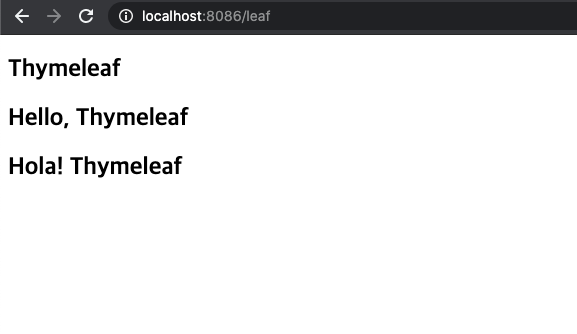
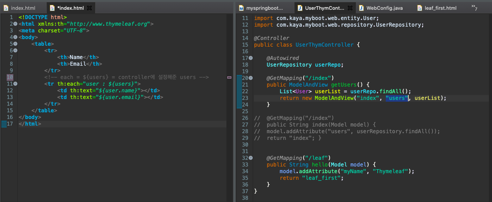
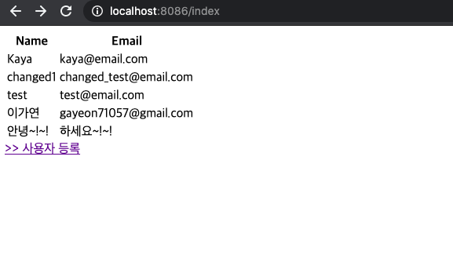
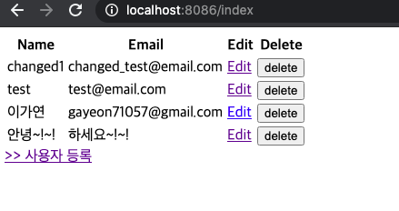
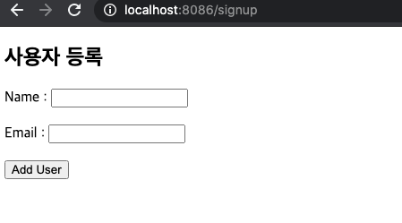

# ☘️ Thymeleaf 사용하기

[목표]

- 타임리프를 사용해서 웹 페이지 구성하기

<br>

### Thymeleaf 타임리프란?

참조 : https://www.thymeleaf.org/documentation.html

> - 스프링 부트의 자동 설정을 지원하는 웹 템플릿 엔진
> - HTML, XML, JS, CSS, 기본 텍스트까지 지원
> - 확장성이 좋고 유지보수가 쉬운 템플릿을 쉽게 만들 수 있도록 도와줌
> - **HTML**문서에 HTML5 문법으로 서버쪽 로직을 수행하고 적용시킬 수 있음
> - HTML 디자인에 전혀 영향을 미치지 않고 웹 템플릿 엔진을 통해 HTML 생성 가능 (디자인 - 개발팀의 커뮤니케이션 도와줌)
> - **템플릿 엔진, th:xx** 형식으로 속성을 html 태그에 추가하여 값 처리
> - WAR 패키징이 필수인 JSP와 다르게 JAR 패키징으로 동작하기 때문에 thymeleaf를 가장 많이 사용

<br><br>

### Thymeleaf 타임리프 표현식

<br>

#### 1. Variable Expressions - \${ }

: 해당 Context의 포함된 변수들을 사용할 수 있음

```html
<tr th:each="user : ${users}">
  <td th:text="${user.name}"></td>
  <td th:text="${user.email}"></td>
</tr>
```

#### 2. Selection Variable Expressions - \*{ }

: 가까운 DOM에 th:object로 정의된 변수가 있다면 그 변수에 포함된 값을 생략하고 나타낼 수 있음

```html
<tr th:object="${users}">
  <!-- *{name} == ${users.name} -->
  <td th:text="*{name}"></td>
  <td th:text="*{email}"></td>
</tr>
```

#### 3. Message Expressions - #{ }

: 미리 정의된 message.properties 파일이 있다면 #표현식으로 나타낼 수 있음

```html
<span th:if="${#fields.hasErrors('name')}" th:errors="*{name}"></span>
```

```java
//[에러 메세지를 포함하는 객체]
@Column	@JacksonXmlProperty
@NotBlank(message = "* Name은 필수 입력 항목입니다. ")
private String name;

@Column(unique=true)
@JacksonXmlProperty
@NotBlank(message = "* Email은 필수 입력 항목입니다. ")
private String email;
```

#### 4. Link URL Expressions - @{ }

: @표현식을 이용하여 다양하게 URL을 표현할 수 있음

```html
<!-- adduser url 연걸  -->
<form
  action="#"
  th:action="@{/adduser}"
  th:object="${user}"
  method="post"
></form>
```

<br><br>

### Thymeleaf 타임리프 사용예제

<br>

#### > 기본 페이지 띄워보기~!

> Hello page 띄우기

<br>

[leaf_first.html] : 화면에 띄울 html 설정

```html
<!DOCTYPE html>
<html xmlns:th="http://www.thymeleaf.org">
  <head>
    <meta charset="UTF-8" />
    <title>leaf_first</title>
  </head>
  <body>
    <h2 th:text="${myName}">text</h2>
    <h2>Hello, <span th:text="${myName}"></span></h2>
    <h2>Hola! [[${myName}]]</h2>
  </body>
</html>
```

<br>

[UserContoller.java] : url 매핑

```java
@Controller
public class UserThymController {

    @GetMapping("/leaf")
    public String hello(Model model) {
    model.addAttribute("myName", "Thymeleaf");
    // leaf_first.html
    return "leaf_first";
    }
}
```

[웹 페이지 화면]



<br>
<br>

#### > index와 유저 등록 페이지 띄우기

> `<form></form>` 태그로 새로운 유저를 등록하고, index페이지에 값 뿌려주기

<br>

[UserController.java] : /index url 매핑

```java
@Controller
public class UserThymController {

	@Autowired
	UserRepository userRepo;

	@GetMapping("/index")
	public ModelAndView getUsers() {
		List<User> userList = userRepo.findAll();
		return new ModelAndView("index", "users", userList);
	}

	@GetMapping("/leaf")
	public String hello(Model model) {
		model.addAttribute("myName", "Thymeleaf");
		return "leaf_first";
	}
}
```

<br>

[src/main/resources/**templates**/index.html] : 등록된 유저리스트를 모두 볼 수 있는 페이지 작성

```html
<!DOCTYPE html>
<html xmlns:th="http://www.thymeleaf.org">
  <meta charset="UTF-8" />
  <body>
    <table>
      <tr>
        <th>Name</th>
        <th>Email</th>
      </tr>
      <!-- each = ${users} = controller에 설정해준 users -->
      <tr th:each="user : ${users}">
        <td th:text="${user.name}"></td>
        <td th:text="${user.email}"></td>
      </tr>
    </table>
    <a href="/signup"> >> 사용자 등록 </a>
  </body>
</html>
```

<br>

[**주의**]

> - Controller에서 넘겨주는 객체명을 html에서 정확히 받아줘야 함
> - Controller getUsers()로 넘겨준 'users'와 index.html에서 th:each 에서 받아주는 객체 'users'의 이름이 정확히 같아야 함



<br>

[localhost:포트 번호/index로 설정접속한 웹 화면]



#### > User CRUD 구현하기

<br>

[Controller.java]

```java
@Controller
public class UserThymController {

	@Autowired
	UserRepository userRepo;

	@GetMapping("/edit/{id}")
	public String showUpdateForm(@PathVariable("id") long id, Model model ) {
		User editUser = userRepo.findById(id).orElseThrow(()-> new IllegalArgumentException("유효하지 않은 아이디입니다. "));
		model.addAttribute("user", editUser);
		return "update";
	}

	@GetMapping("/update/{id}")
	public String updateUser(@PathVariable("id") long id, @Valid User user, BindingResult result, Model model) {
		if(result.hasErrors()) {
			return "update";
		}
		userRepo.save(user);
		return "redirect:/index";
	}

	@GetMapping("/delete/{id}")
	public String deleteUser(@PathVariable("id") long id, Model model) {
		userRepo.deleteById(id);
		return "redirect:/index";
	}

	@GetMapping("/signup")
	//showSignUpForm() 인자를 안넘겨주면 에러 발생
	//user은 클래스 이름이라서 타입만 User로 잘 지정해주면 이름은 상관없음
	public String showSignUpForm(User user) {

	//add-user.html에 User 오브젝트를 넘겨주기 위함
	return "add-user";
	}

	@PostMapping("/adduser")
	//BidingResult
	public String addUser(@Valid User user, BindingResult result, Model model){

		//입력 항목에 오류가 있는지 체크
		if (result.hasErrors()){
			//에러 발견시 입력페이지 다시 뿌려줌
			return "add-user";
		}
		userRepo.save(user);

		//index로 바로 redirect해줌
		return "redirect:/index";
	}

	@GetMapping("/index")
	public ModelAndView getUsers() {
		List<User> userList = userRepo.findAll();
		return new ModelAndView("index", "users", userList);
	}

	@GetMapping("/leaf")
	public String hello(Model model) {
		model.addAttribute("myName", "Thymeleaf");
		return "leaf_first";
	}
}
```

<br>

[src/main/resources/**templates**/index.html] : Edit과 Delete 기능 추가

```html
<!DOCTYPE html>
<html xmlns:th="http://www.thymeleaf.org">
<meta charset="UTF-8">
<body>
    <table>
	    <tr>
		<th>Name</th>
		<th>Email</th>
		<th>Edit</th>
		<th>Delete</th>
	    </tr>

	    <tr th:each="user : ${users}">
		<td th:text="${user.name}"></td>
		<td th:text="${user.email}"></td>
		<td><a th:href=@{/edit/{id}(id=${user.id})}>Edit </a> </td>
		<td><button th:onclick="deleteUser('[[${user.name}]]')"/>delete</button></td>
		<td><a th:href=@{/delete/{id}(id=${user.id})}>Delete</a> </td>
	    </tr>
    </table>
    <a href="/signup"> >> 사용자 등록 </a>
</body>
</html>
```

[웹 페이지 화면]



<br>

[src/main/resouces/templates/add-user.html] : 유저 등록 폼

```html
<!DOCTYPE html>
<html xmlns:th="http://www.thymeleaf.org">
  <meta charset="UTF-8" />
  <body>
    <h2>사용자 등록</h2>
    <form action="#" th:action="@{/adduser}" th:object="${user}" method="post">
      <label for="name">Name : </label>
      <input type="text" th:field="*{name}" id="name" />
      <!-- user에 설정해둔 에러메세지가 이 span에 출력됨   -->
      <span th:if="${#fields.hasErrors('name')}" th:errors="*{name}"></span>

      <br /><br />

      <label for="email">Email : </label>
      <input type="text" th:field="*{email}" id="email" />
      <span th:if="${#fields.hasErrors('email')}" th:errors="*{email}"></span>

      <br /><br />
      <input type="submit" value="Add User" />
    </form>
  </body>
</html>
```

[웹 페이지 화면]



<br>

[src/main/resouces/templates/update.html] : 유저 정보 수정 입력 form

```html
<!DOCTYPE html>
<html xmlns:th="http://www.thymeleaf.org">
  <meta charset="UTF-8" />
  <body>
    <h2>사용자 정보 수정</h2>
    <form
      action="#"
      th:action="@{/update/{id}(id=${user.id})}"
      th:object="${user}"
      method="get"
    >
      <label for="name">Name : </label>
      <input type="text" th:field="*{name}" id="name" />
      <!-- user에 설정해둔 에러메세지가 이 span에 출력됨   -->
      <span th:if="${#fields.hasErrors('name')}" th:errors="*{name}"></span>

      <br /><br />

      <label for="email">Email : </label>
      <input type="text" th:field="*{email}" id="email" />
      <span th:if="${#fields.hasErrors('email')}" th:errors="*{email}"></span>

      <br /><br />
      <input type="submit" value="수정완료" />
    </form>
  </body>
</html>
```

[웹 페이지 화면]


<br>

#### + 자바스크립트 요소 추가하기

[src/main/resources/**templates**/index.html] : javascript 코드로 confirm화면 띄우기

```html
<!DOCTYPE html>
<html xmlns:th="http://www.thymeleaf.org">
<meta charset="UTF-8">
<!-- 자바스크립트 코드 추가 -->
<script type="text/javascript">
    function deleteUser(userName){
	var result = confirm(userName+" 를 정말로 삭제하시겠습니까?");
	    if(result){
		location.href = "delete/" + userId;
	}
}
</script>
<body>
    <table>
	<tr>
	    <th>Name</th>
	    <th>Email</th>
	    <th>Edit</th>
	    <th>Delete</th>
	</tr>
		<!-- each = ${users} = controller에 설정해준 users -->
	<tr th:each="user : ${users}">
	    <td th:text="${user.name}"></td>
	    <td th:text="${user.email}"></td>
	    <td><a th:href=@{/edit/{id}(id=${user.id})}>Edit </a> </td>
	    <td><button th:onclick="deleteUser('[[${user.id}]]','[[${user.name}]]')"/>delete</button></td>

		<!-- <td><a th:href=@{/delete/{id}(id=${user.id})}>Delete</a> </td> -->
	</tr>
	</table>
	<a href="/signup"> >> 사용자 등록 </a>
</body>
</html>
```

[웹 페이지 화면]


<br>
