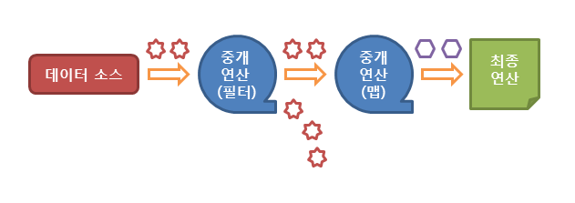

## JAVA8 변경 사항(스트림 API)

#### 스트림 API(Stream API)

>스트림 API는 데이터를 추상화하여 다루며, 다양한 방식으로 저장된 데이터를 읽고 쓰기 위한 공통된 방법을 제공

* 데이터 접근에 있어서의 기존 자바의 문제점
  1. 자바에서는 많은 양의 데이터를 저장하기 위해서 배열이나 컬랙션을 사용함
  2. 저장된 데이터에 접근하기 위해서는 반복문이나 반복자(iterator)를 사용하여 매번 코드를 작성해야 했음
  3. 이렇게 작성된 코드는 너무 길고 가독성이 떨어짐
  4. 코드의 재사용이 거의 불가함
  5. 또한, 데이터 베이스의 쿼리와 같은 정형화된 처리 패턴을 가지지 못했기에 데이터마다 다른 방법으로 접근해야 함

* 극복

  1. Java SE 8 버전 부터 도입된 스트림(Stream API)로 문제점 극복

  2. 스트림 API는 데이터를 추상화하여 다루므로, 다양한 방식으로 저장된 데이터를 읽고 쓰기 위한 공통된 방법을 제공함

  3. 스트림 API를 이용하여 배열이나 컬렉션뿐만 아니라 파일에 저장된 데이터도 모두 같은 방법으로 다룰 수 있음

     ```java
     String[] arr = new String[]{"넷", "둘", "셋", "하나"};
     
     // 배열에서 스트림 생성
     Stream<String> stream1 = Arrays.stream(arr);
     stream1.forEach(e -> System.out.print(e + " "));
     System.out.println();
     
     // 배열의 특정 부분만을 이용한 스트림 생성
     Stream<String> stream2 = Arrays.stream(arr, 1, 3);
     stream2.forEach(e -> System.out.print(e + " "));
     
     
     // 실행 결과
     넷 둘 셋 하나 
     둘 셋 
     ```


#### 스트림 API의 특징

1. 스트림은 외부 반복을 통해 작업하는 컬렉션과는 달리 내부 반복(internal iteration)을 통해 작업을 수행함
2. 스트림은 재사용이 가능한 컬렉션과는 달리 단 한 번만 사용할 수 있음
3. 스트림은 원본 데이터를 변경하지 않음
4. 스트림의 연산은 필터-맵(filter-map) 기반의 API를 사용하여 지연(lazy) 연산을 통해 성능을 최적화함
5. 스트림은 paralleStream() 메소드를 통한 손쉬운 병렬 처리를 지원함


#### 스트림 API의 동작 흐름

> 스트림 API는 세가지 단계에 걸쳐 동작함

1. 스트림의 생성
2. 스트림의 중개 연산(스트림의 변환)
3. 스트림의 최종 연산(스트림의 사용)




